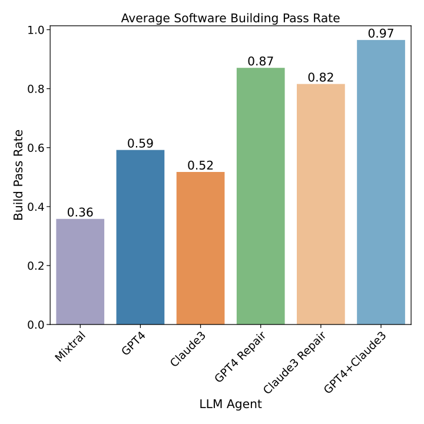

# LLM Agent for Software Building and Installation
Automating HPC Software Compilation, Deployment, and Error Resolution  through Large Language Model Agents

# Abstract
In high-performance computing (HPC) environments, software modules enable user-driven computation. Still, their compilation and installation are traditionally manually intensive and require expert knowledge due to their unique deployment requirements. The presented work introduces large language model (LLM) agents to streamline and enhance the HPC software-building pipeline. Our methodology leverages LLMs to automate the generation and execution of build scripts for software packages, including fetching source code, compilation script generation, software building, and post-build testing. Using OpenAI's ChatGPT 4 and Claude 3 models, our LLM agent demonstrated a 97% success rate in autonomously building over 200 common HPC software packages on a benchmark cluster. Furthermore, these agents can identify and rectify build and test failures through iterative script modification. Lastly, our agents describe the issues experienced and make recommendations to system admins when manual intervention is required. This advancement significantly reduces administrative overhead, enabling HPC administrators to allocate resources to other critical tasks.

# Requirements
Inside /code/reqquirements.txt is a list of the python libraries required to run the BuilderAgent class.

Python 3.10 was used for development and deployment on Ubuntu Server 22.04 LTS.

# Usage
Import Agent from BuilderAgent.
